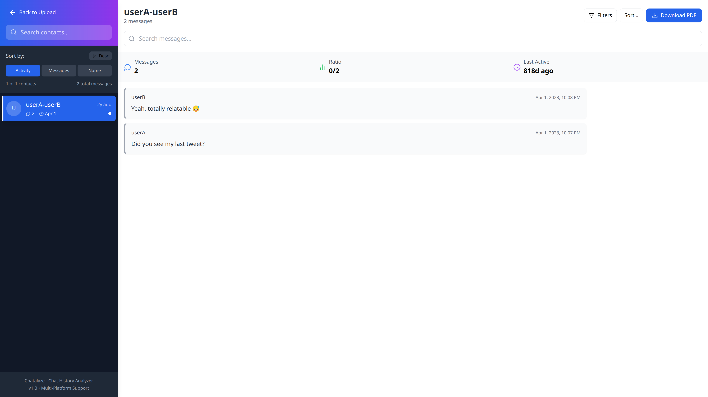
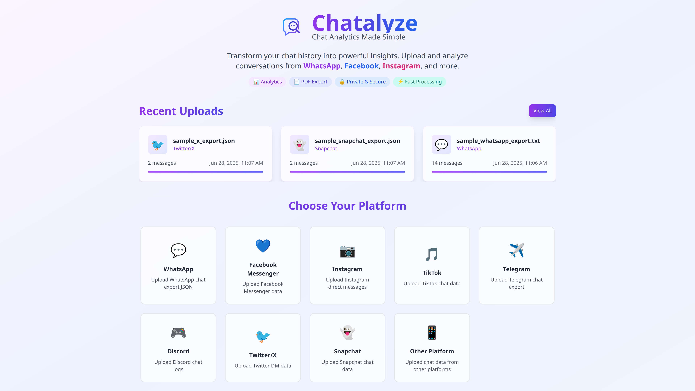

<div align="center">


# 🎯 Chatalyze

## *Chat Analytics Made Simple*

**Transform your chat history into powerful insights with our comprehensive multi-platform analyzer.**

[](https://lusansapkota.com.np)
[](https://www.typescriptlang.org/)
[](https://reactjs.org/)
[](https://vitejs.dev/)

[](https://opensource.org/licenses/MIT)
[](https://github.com/Lusan-sapkota/chat-history-analyzer/issues)
[](https://lusansapkota.com.np)

---

## 🚀 [Live At](https://chat-history-analyzer.vercel.app/)
[](https://chat-history-analyzer.vercel.app/)

## ✨ What is Chatalyze?

**Chatalyze** is a powerful, privacy-focused chat analytics platform that transforms your messaging history into meaningful insights. Whether you're analyzing WhatsApp conversations, Facebook messages, or Instagram DMs, Chatalyze provides a comprehensive suite of tools to understand your digital communications.

### 🎯 Key Highlights

- 🔒 **100% Private** - All processing happens locally in your browser
- 🚀 **Lightning Fast** - Optimized for performance with large datasets
- 📱 **Universal Support** - Works with 8+ major messaging platforms
- 🎨 **Beautiful UI** - Modern, responsive design that adapts to any device
- 📊 **Rich Analytics** - Deep insights into your communication patterns

---

## 🌟 Features

### 🚀 Core Features

- Multi-Platform Support
- PDF Export
- Advanced Search
- Smart Filtering
- Bulk Processing

### 📊 Analytics

- Message Statistics
- Activity Patterns
- Contact Rankings
- Timeline Analysis
- Export Options

### 🎨 Experience

- Modern UI/UX
- Responsive Design
- Dark/Light Themes
- Intuitive Navigation
- Mobile Optimized

### 📱 Supported Platforms

- 💬 **WhatsApp** - Complete chat export analysis
- 💙 **Facebook Messenger** - Message history insights
- 📷 **Instagram** - Direct message analytics
- 🎵 **TikTok** - Chat data processing
- ✈️ **Telegram** - Export file support
- 🎮 **Discord** - Server & DM analysis
- 🐦 **Twitter/X** - Direct message insights
- 👻 **Snapchat** - Chat history processing

---

## 🎥 Demo & Screenshots

### 📸 Application Screenshots

| Chat Analysis & Sidebar Interface | Upload Interface & Platform Selection |
|:---:|:---:|
|  |  |

---

## 🚀 Quick Start

### Prerequisites

- Node.js 18+
- npm or yarn

### Installation

```bash
# Clone the repository
git clone https://github.com/Lusan-sapkota/chat-history-analyzer.git

# Navigate to project directory
cd chatalyze

# Install dependencies
npm install

# Start development server
npm run dev
```

### Usage

1. **🎯 Select Platform** - Choose your messaging platform
2. **📤 Upload Data** - Drag & drop your chat export file
3. **📊 Analyze** - Explore insights, statistics, and patterns
4. **📄 Export** - Generate PDF reports or export data

---

## 💡 Why Chatalyze?

| **Traditional Tools** | **Chatalyze** |
|:---|:---|
| ❌ Limited platform support | ✅ 8+ major platforms supported |
| ❌ Privacy concerns | ✅ 100% local processing |
| ❌ Complex setup | ✅ Drag & drop simplicity |
| ❌ Basic analytics | ✅ Comprehensive insights |
| ❌ Poor mobile experience | ✅ Mobile-first design |

---

## 🛡️ Privacy & Security

Your privacy is our top priority. **Chatalyze** operates with these principles:

- 🔒 **Local Processing** - All data analysis happens in your browser
- 🚫 **No Data Upload** - Your chats never leave your device
- 🛡️ **Zero Tracking** - No analytics, cookies, or user tracking
- 🔐 **Open Source** - Transparent, auditable codebase

---

## 👨‍💻 About the Developer

**Created with ❤️ by [Lusan Sapkota](https://lusansapkota.com.np)**

Passionate developer crafting innovative solutions for digital communication analysis

[](https://lusansapkota.com.np)
[](https://github.com/lusansapkota)

---

## 🤝 Support & Contributing

### Need Help?

- 📋 **Report Issues**: [GitHub Issues](https://github.com/yourusername/chatalyze/issues)
- 🌐 **Visit Website**: [lusansapkota.com.np](https://lusansapkota.com.np)
- 💬 **Feature Requests**: Open an issue with your ideas

### Contributing

We welcome contributions! Please read our [**Contributing Guidelines**](CONTRIBUTING.md) to get started.

**Quick ways to contribute:**

- 🐛 Report bugs
- 💡 Suggest features  
- 🔧 Submit pull requests
- ⭐ Star the repository
- 📖 Improve documentation

---

## 📄 License

This project is licensed under the MIT License - see the [LICENSE](LICENSE) file for details.

---

<div align="center">

**⭐ Star this repository if Chatalyze helped you!**

*Making chat analysis accessible, private, and powerful for everyone.*

**Built with passion by [Lusan Sapkota](https://lusansapkota.com.np) | © 2025**

</div>
